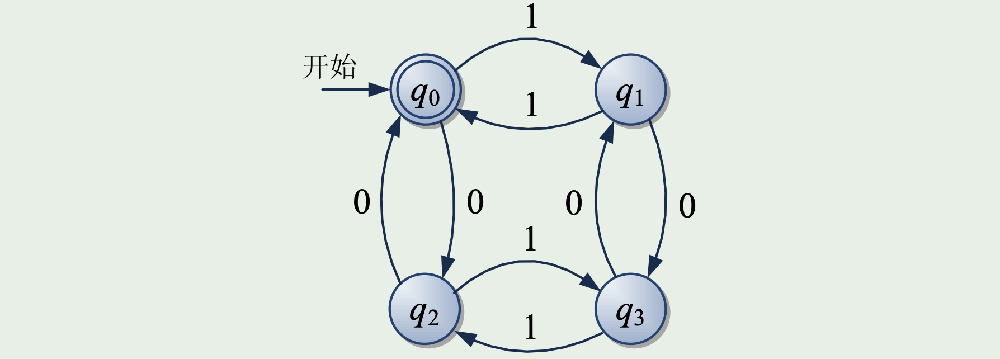
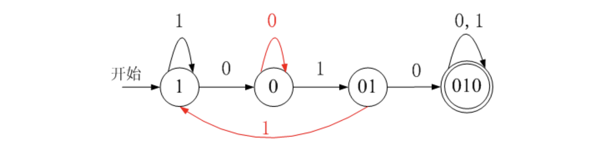
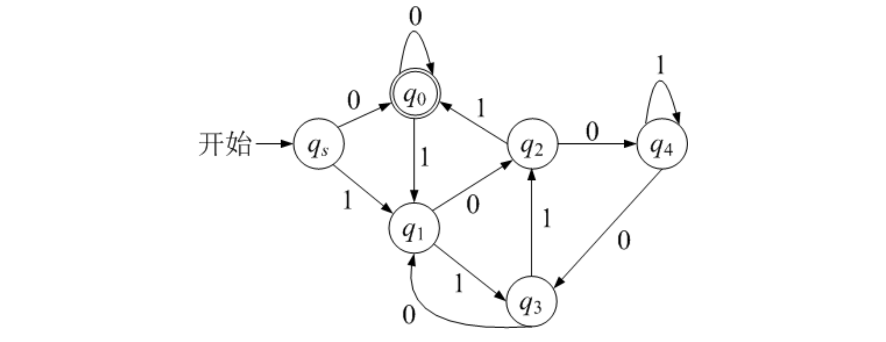
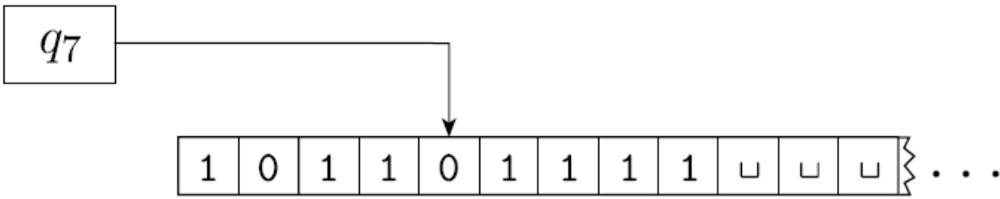
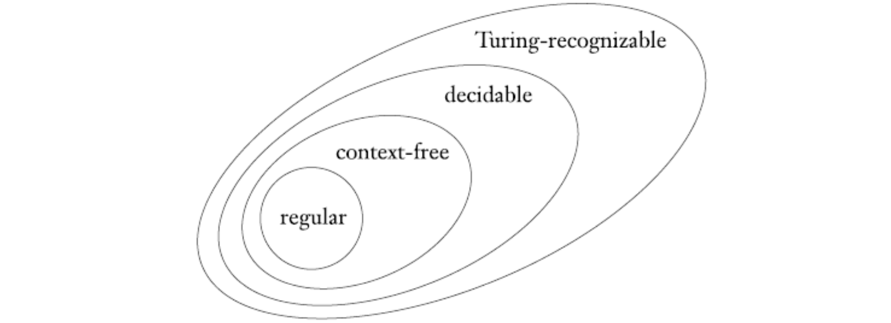
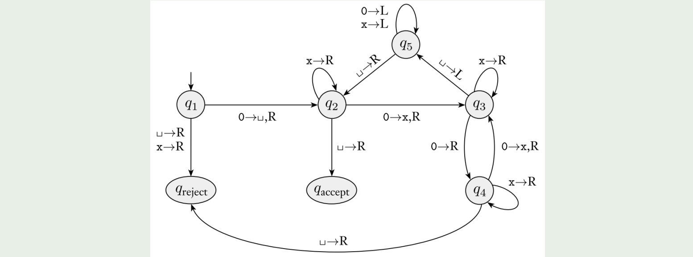

# 人工智能数学基础

## Introduction

- power set 幂集
  - A = {0, 1}, P(A) = {∅, {0}, {1}, {0, 1}}

- predicate 谓词 or property 性质
  - 值域为 {TRUE, FALSE} 的函数

- 序列是某些元素元素或成员按某种顺序排成的表

  -  序列中的元素的顺序和是否重复很重要
  -  有穷序列也被称为多元组

- k-tuple k-元组
  
  - k 个元素的序列
  - (7, 21, 57) is a 3-tupl
  - ordered pair is a 2-tuple 有序对

- **Cartesian product 笛卡尔积**: 

  - A × B = {(a, b) | a ∈ A and b ∈ B}.

### 函数

- **函数**是一个建立输入-输出关系的对象
  - 对于每一个函数, 同样的输入总会产生同样的输出
  - 函数又称为映射

- f : D → R
  - 定义域到值域，函数取得值域的所有元素
  - Let Zm = {0, 1, 2, . . . , m − 1}     g : Z4 × Z4 → Z4
  - 函数 g 为模 4 的加法函数
  - Z4 × Z4为定义域，Z4是值域
  
- k 元函数
  - k 个自变量的函数
  - k: 函数的元数 arity

- 定义域为 A × · · · × A 的谓词称为关系，或称为 k 元关系
  - binary relation 二元关系: a 2-ary relation
  - 设 R是一个二元关系, 则命题 aRb 表示 aRb =TRUE

- **equivalence relation 等价关系**: 如果**二元关系** R 满足以下三个条件，则 被称为**等价关系**: 
  - 1. R 是自反的, 即对每一个 x, xRx 
    2. R 是对称的, 即对每一个 x 和 y, xRy 意味着 yRx 
    3. R 是传递的, 即对每一个 x, y 和 z, xRy 和 yRz 意味着 xRz

- **Alphabets 字母表**
  - 定义字母表(alphabets)为任意一个非空有穷集合
  - 字母表的成员为该字母表的符号(symbol).
  - Σ1 = {0, 1}
  - Σ2 = {a, b, c, d, e, f, g, h, i, j, k, l, m, n, o, p, q, r, s, t, u, v, w, x, y, z} 
  - Γ = {0, 1, x, y, z}

### Strings 字符串

- 字母表上的字符串为该字母表中**符号的有穷序列**
  - Σ1 = {0, 1}, 01001 为 Σ1 上的一个字符串
  - Σ2 = {a, b, c, . . . , z}, abracadabra 为 Σ2 上的一个字符串

- 长度
  - 设 w 是Σ 上的一个字符串, w 的长度, 记作 |w|
  - 等于它所包含的符号数.

- **empty string 空串**
  - 长度为零的字符串
  - 记作 **ε**

- 若 |w| = n, 则 w = a1a2 · · · an, 这里 ai ∈ Σ
- **w 的反转 (reverse)**: 记作 $w^R$, 为 $w^R = a_na_{n−1}\cdots a_1$
- **substring 子串**
  - 如果字符串 z 连续地出现在 w 中, 则称 z 是 w 的子串
  - cad 是 abracadabra 的子串
- **concatenation 字符串的连接**
  - 字符串 x 和字符串 y 的连接, 记作 xy
  - |x| = m and |y| = n 
  - x 和 y 的连接为 $x_1 \cdots x_my_1\cdots y_n$​
  - 可采用上标法表示一个字符串自身连接多次 $\begin{matrix}k\\ \overbrace{xx\cdots x}\end{matrix}$​

### Languages 语言

- **字符串的字典序 lexicographic order**
  - 比较第一个字符,如果第一个字符不同,则按字符的ASCII码大小关系排序
  - 如果第一个字符相同,则比较第二个字符,依此类推
  - 如果所有字符都相同,则短字符串排在长字符串前面

- **字符串顺序 shortlex order or string order**
  - 它在字典序的基础上将短的字符串排在长的字符串的前面
  - 字母表 {0, 1} 上所有的字符串顺序为 (ε, 0, 1, 00, 01, 10, 11, 000, . . .)

- **前缀 prefix**
  - 如果存在字符串 z 满足 xz = y，则字符串 x 是字符串 y 的前缀
  - 若 x 6= y, 则 x 是 y 的 **真前缀 proper prefix**

- 字符串的集合称为 **语言 language**
  - 如果语言中任何一个成员都不是其他成员的真前缀, 那么该语言则是 **无前缀的 prefix-free**

### 语言的运算

- **语言的连接**
  - 设L1为字母表Σ1上的语言，L2为字母表Σ2上的语言，L1和L2的连 接L1L2由下式定义
  - L1L2 = {xy | x ∈ L1, y ∈ L2}
  - 设Σ1 = {a, b}，Σ2 = {0, 1}，L1 = {ab, ba, bb}，L2 = {00, 11}
  - 则 L1L2 = {ab00, ab11, ba00, ba11, bb00, bb11}

- **语言的闭包**
  - 语言L的闭包记作 $L^∗$
  - 设Σ = {0, 1}，L = {10, 01}
  - 则 $L^0$ = {ε}
  - $L^1$ = L = {10, 01} 
  - $L^2$ = LL = {1010, 1001, 0110, 0101}，
  - $L^∗$ = {ε, 10, 01, 1010, 1001, 0110, 0101, 101010, 101001, 100110, 100101, · · · }

- 字母表Σ本身也是Σ上的语言
  - $\sum^+$​：由Σ中的字符组成的全体字符串的集合（不包括ε）
  - $\sum^* = \sum^+ \cup \{\varepsilon \}$

  - $\sum ^* = \sum^+ \cup  \{ \varepsilon \} $

  - 设 $\sum = \{0, 1\}$，则 $\sum ^* = \{ \varepsilon, 0, 1, 00, 01, 10, 11, 000, 001, 010, 011, 100, 101, 110, 111, \cdots \} $ 由0和1组成的一切长度、一切次序的串（包括空串）

计算理论：什么是计算

1. 可计算性
2. 计算复杂性
3. 计算模型——图灵机

## 有穷自动机

### 非形式化描述

- 有穷多个状态
- 输入信号
- 状态转移
- 初始状态

当前状态 $+$ 输入信号 $\rightarrow$​ 下一状态

### 有穷自动机的定义

有穷自动机`Finite Automata, FA`，一个有穷自动机是一个五元组

$M = (Q,\sum,\delta,q_0,F)$

- $Q$ 有穷状态集
- $\sum$ 有穷的输入字母表
- $\delta$  转移函数，即映射 $\delta : Q \times \sum \rightarrow Q$，最关键的部分
- $q_0 \in Q$​ 初始状态
- $F\in Q$​ 接受状态集
  - 自动机处理完输入序列时，如果最终停留在一个接受状态，则表示输入序列被自动机接受

例如：

-  M = ({q0, q1, q2, q3}, {0, 1}, δ, q0, {q0})

- 转移函数 δ 定义如下

  - δ(q0, 0) = q2
  - δ(q0, 1) = q1
  - δ(q1, 0) = q3
  - δ(q1, 1) = q0
  - δ(q2, 0) = q0
  - δ(q2, 1) = q3
  - δ(q3, 0) = q1
  - δ(q3, 1) = q2

- 转移图表达了五元组的全部信息

- **扩充转移函数**
  - **递归定义**：将原来 $\delta$ 中的第二个变元由一个字符扩充为一个字符串
  - $\hat{\delta} : Q \times \sum^* \rightarrow Q$​
  - $\hat{\delta}(q, \varepsilon) = q$
  - $\hat{\delta}(q, aw) = \hat{\delta}(\delta(q,a), w)$

- $\delta(q0, 010) = \hat{\delta}(\delta(q0, 0), 10) = \hat{\delta}(q2, 10) = \hat{\delta}(\delta(q2, 1), 0) = \hat{\delta}(q3, 0) = \hat{\delta}(\delta(q3, 0), \varepsilon) = \hat{\delta}(q1, \varepsilon) = q1$

- $\hat{\delta}(q, x)$ 的值
  -  从状态 q 出发，用基本转移函数 δ
  - 每越过 x 的一个符号后，改变一次状态
  - 直到越过 x 的最后一个符号所得到的状态
- 从 $\delta$ 到 $\hat{\delta}$ 的扩充很自然
  -  $\delta$ 就是 $\hat{\delta}$ 的特例（当 |x| = 1 时）
  - 今后不再强调 $\hat{\delta}$ ，而一律用 $\delta$ 表示

### 有穷自动机接受的语言

- 给出FA M = (Q, Σ, δ, q0, F) 
  - 若 δ(q0, x) = p ∈ F (x ∈ Σ∗ ) 
  - 则称字符串 x 被 M 接受

- 被 M 接受的全部字符串的集合，称为 **M 接受的语言**，记作 **L(M)**
  - L(M) = {x | δ(q0, x) ∈ F}
  - L(M) = {一切含有偶数个 0 和偶数个 1 的字符串}

- 给出 FA ，指明它所接受的语言
  - FA ⇒ 语言
- 给出语言，构造接受它的 FA
  - 语言 ⇒ FA

#### 由语言构造FA

- L1 = {x | x ∈ {0, 1} ∗ ,且x中至少包含一个子串010}

- L2 = {x | x ∈ {0, 1} ∗ ,且x中不能出现子串010}

- 构造一个FA M，它接受的语言为： L = {x | x ∈ {0, 1} +，且把x看成二进制数时，x模5余0} （即x为二进制数，能被5整除）

- 提示： 当二进制数x的位数向右不断增加时，其值的增加有规律
  - 二进制x0，十进制2x
  -  二进制x1，十进制2x + 1
- x模5余0，2x模5余0，2x + 1模5余1
- x模5余1，2x模5余2，2x + 1模5余3
- x模5余2，2x模5余4，2x + 1模5余0
- x模5余3，2x模5余1，2x + 1模5余2
- x模5余4，2x模5余3，2x + 1模5余4

## 丘奇-图灵论题

### 图灵机

#### Turing machine 图灵机

- 图灵机用一个无限长的纸带作为无限存储
  - 它有一个读写头, 能在纸带上读、写和左右移动
  - 图灵机在开始工作时, 纸带上只有输入串, 其他地方都是空白的
  - 如果需要保存信息, 它可将这个信息写在纸带上
  - 为了读已经写下的信息, 它可将读写头往回移动到这个信息所在的位置
  - 机器不停地计算, 直至产生输出为止
  - 机器预置了接受和拒绝两种状态, 如果进入这两种状态, 就产生输出 **接受 accept 和 拒绝 reject**
  - 如果不能进入任何接受或拒绝状态, 就继续执行下去, **永不停止**

- 有穷自动机与图灵机之间的区别
  - 图灵机在纸带上既能读也能写
  - 图灵机的读写头既能向左移动也能向右移动
  - 图灵机的纸带是无限长的
  - 图灵机进入拒绝和接受状态将立即停机.

- 考虑图灵机 M1, 它检查语言 B 的成员关系
  - B = {w#w | w ∈ {0, 1} ∗} 
  - 即要设计 M1, 使得如果输入是 B 的成员, 它就接受, 否则拒绝
  - 对于输入字符串 w: 
    - 在 # 两边对应的位置来回移动. 检查这些对应位置是否包含相同的符号, 如不是, 或者没有 # , 则拒绝
    - 为记录对应的符号, 消去所有检查过的符号
    - 当 # 左边的所有符号都被消去时, 检查 # 的右边是否还有符号, 如果是, 则拒绝, 否则接受

**图灵机的形式化定义**

- 图灵机 (TM)是一个 7-元组 $(Q, \sum, \Gamma , \delta, q_0, q_{accept}, q_{reject})$, 其中 $Q, \sum, \Gamma$ 都是有穷集合, 并且
  - $Q$ **是状态集**
  - $\sum$ 是**输入字母表**, 不包括特殊空白符号 $\sqcup$
  - $\Gamma$ 是**纸带字母表**, 其中 $\sqcup  \in \Gamma$ , $\sum  \subseteq  \Gamma$
  - $\delta$ : $Q \times  \Gamma \to Q \times  \Gamma  \times \{L, R\}$ 是**转移函数**
  - $q_0 ∈ Q$ 是**起始状态**
  - $q_{accept} ∈ Q$ 是**接受状态**
  - $q_{reject} ∈ Q$ 是**拒绝状态**, 且 $q_{accept} \ne q_{reject}$

#### 图灵机的格局 configuration

- uqv
- 当前状态 q
- 当前纸带内容 uv
- 读写头当前位置： v 的第一个符号

- 纸带上 v 的最后一个符号以后的符号都是空白符

- **1011q701111**

- 格局 C1 **产生 yields** 格局 C2 
  - 如果图灵机能够合法地从格局 C1 一步进入 C2

- 当读写头处于格局的两个端点之一时, 会发生特殊变化
  - 对于左端点
    - 向左移动: $q_ibv$ 产生 $q_jcv$ 
    - 向右移动: $q_ibv$ 产生 $cq_jv$ 
  - 对于右端点
    - $uaq_i$ 等价于 $uaq_i \sqcup$

**图灵机 M 读入输入字符串** 

- w 起始格局(start configuration): q0w 
- 接受格局(accepting configuration): · · · qaccept · · · 
- 拒绝格局(rejecting configuration): · · · qreject · · · 
- 接受状态和拒绝状态都是停机格局(halting configurations), 它们都不再 产生新的格局.

- 因为机器只在接受或拒绝状态下才停机, 因此可以等价地将转移函数记 为
  - δ : Q‘ × Γ → Q × Γ × {L, R}, where Q’ = Q − {qaccept, qreject}

#### Turing-recognizable 图灵可识别

图灵机 M 接受(accepts)输入 w, 如果存在格局的序列 C1, C2, . . . , Ck 使 得 

- C1 是 M 在输入 w 上的起始格局
- 每一个 Ci 产生 Ci+1
- Ck 是接受格局

M 接受的字符串的集合称为 M 的语言, 或被 M识别的语言, 记为 L(M)

**如果一个语言能被某一图灵机识别, 则称该语言是图灵可识别的 (Turing-recognizable)**

- 图灵可识别语言也可被称为递归可枚举语言(recursively enumerable language).
- 在输入上运行一个图灵机时, 可能出现三种结果
  -  1 接受
  -  2 拒绝
  -  3 循环
- 这里循环(loop)仅仅指机器不停机.

#### Turing-decidable 图灵可判定的

对于一个输入, 图灵机 M 有两种方式不接受它, 一种是进入拒绝状态而拒绝它, 另一种是进入循环

有时候很难区分机器是进入了循环还是需要耗费长时间的运行

因此, 人们更喜欢对所有输入都停机的图灵机, 它们永不循环. 

这种机器被称为**判定器(deciders)**, 因为它们总能决定是接受还是拒绝. 

对于可以识别某个语言的判定器, 称其判定(decide)该语言.

这种机器被称为**判定器(deciders)**, 因为它们**总能决定是接受还是拒绝** 

对任何输入都停机的图灵机, 又被称为总停机的图灵机, **总停机的图灵机**也被称为**算法**

对于可以识别某个语言的判定器, 称其判定(decide)该语言.

**如果一个语言能被某一图灵机判定, 则称它是图灵可判定的(Turing-decidable), 简称可判定的(decidable).**

- 图灵可判定语言也被称为**递归语言(recursively language)**
- 每一个**图灵可判定**语言都是**图灵可识别**的

- Example (构造图灵机 M2, 它判定的语言为 A = {0 2 n |n ≥ 0})
  - 下面给出 M2 的形式化描述：M2 = (Q, Σ, Γ, δ, q1, qaccept, qreject) 
  - Q = {q1, q2, q3, q4, q5, qaccept, qreject} 
  - Σ = {0} 
  - Γ = {0, x, ⊔ } 
  - 将 δ 描述为状态转移图 
  - 开始、接受和拒绝状态分别是 q1, qaccept 和 qreject

### 图灵机的变形

#### Multitape Turing Machines 多带图灵机

- 多带图灵机(multitape Turing machine)很像普通图灵机, 只是有多条纸带, 每条纸带都有自己的读写头用于读和写. 开始时, 输入出现在 第 1 条纸带上, 其他纸带都是空白的
- 转移函数：δ : Q × Γ k → Q × Γ k × {L, R, S} k , 这里 k 是纸带的数量
- δ(qi , a1, · · · , ak) = (qj , b1, · · · , bk, L, R, · · · , L)

**每个多带图灵机等价于某一个单带图灵机**

证明思路: 将一个多带图灵机 M 转换为一个与之等价的单带图灵机 S. 关键是怎样用 S 来模拟 M.

证明:

- S 在自己的纸带上放入 $\# \overset{\cdot}{w}_1 \overset{\cdot}{w}_2 \cdots \overset{\cdot}{w}_n\# \overset{\cdot}{\sqcup}\# \overset{\cdot}{\sqcup}\#\cdots\#$ 此格式表示了 M 的全部 k 个纸带的内容

- 为了模拟多带机的一步移动, S 在其纸带上从标记左端点的第一个 # 开始扫描, 一直扫描到标记右端点的第 k + 1 个 #, 其目的是确定 虚拟读写头下的符号. 然后 S 进行第二次扫描, 并根据 M 的转移函数指示的运行方式更新纸带

- 任何时候, 只要 S 将某个虚拟读写头向右移动到某个 # 上面, 就意味着 M 已将自己相应的读写头移动到了其所在的纸带中的空白区 域上, 即以前没有读过的区域上. 因此, S 在这个纸带方格上写下空白符, 并将这个纸带方格到最右端的各个纸带方格中的内容都向右移动一个. 然后再像之前一样继续模拟

**一个语言是图灵可识别的, 当且仅当存在多带图灵机识别它**

一个语言是图灵可识别的 -> 多带图灵机识别它：单带图灵机是特殊的多带图灵机

多带图灵机识别 -> 语言是图灵可识别的：多带图灵机等价于单带图灵机，单带图灵机识别的语言是可识别语言

#### Nondeterministic Turing Machines 非确定型图灵机

**每个非确定型图灵机都等价于某一个确定型图灵机**

**证明思路:** 

用确定型图灵机 D 来模拟非确定型图灵机 N 的证明思路是：

让 D 试验 N 的非确定型计算的所有可能分支. 

若 D 能在某个分支到达接受状态, 则接受; 否则 D 的模拟将永不终止

**证明:** 

D 的描述如下

- 开始时, 第一条纸带包含输入 w, 第二条纸带和第三条纸带都是空白的
- 把第一条纸带复制到第二条纸带上, 并将第三条纸带的字符串初始化为 $\epsilon$
- 用第二条纸带去模拟 N 在输入 w 上的非确定计算的某个分支. 在 N 的每一步动作之前, 查询第三条纸带上的下一个数字, 以决定在 N 的转移函数所允许的选择中做何选择
- 如果第三条纸带上没有符号剩下, 或这个非确定型的选择是无效的, 则放弃这个分支, 转到第 4 步. 如果遇到拒绝格局也转到第 4 步. 如 果遇到接受格局, 则接受这个输入
- 在第三条纸带上, 用字符串顺序的下一个串来替代原有的串. 转到第 2 步, 以模拟 N 的计算的下一个分支

**一个语言是图灵可识别的, 当且仅当存在非确定型图灵机识别它**

证明: 确定型图灵机自然是一个非确定型图灵机, 此推论的一个方向由此立刻得证. 另一个方向可由定理 3.10 得证

**一个语言是图灵可判定的, 当且仅当存在非确定型图灵机判定它**

证明: 修改定理 3.10 的证明, 如果 N 在计算的所有分支上都能停机, 则 D 也总能停机.

#### Enumerators 枚举器

枚举器是一个 k 带图灵机，最后一带作为输出带

枚举器产生的语言： L(M) = {w|w ∈ Σ ∗ , w能被M打印在输出带上, # ∈/ Σ}

**一个语言是图灵可识别的, 当且仅当存在枚举器枚举它**

**证明：**

- 首先证明：如果有枚举器 E 枚举语言 A, 则有图灵机 M 识别 A. 图灵机 M 对于输入 w:
  - 运行 E, 每当 E 输出一个串时, 将之与 w 比较
  - 如果 w 曾经在 E 的输出中出现过, 则接受

- 现在证明另一个方向. 设 s1, s2, s3, · · · 是 Σ ∗ 中所有可能的串, 如果图灵 机 M 识别语言 A, 则为 A 构造枚举器 E 如下：
  - 对 i = 1, 2, 3, · · · , 重复下列步骤
  - 对 s1, s2, · · · , si 中的每一个 i, M 以其作为输入运行 i 步
  - 如果有计算接受, 则打印出相应的 sj

### 算法的定义

#### 希尔伯特

- 希尔伯特第 10 问题旨在设计一个算法来检测一个多项式是否有整数根
- The Church–Turing Thesis 邱奇-图灵论题
- 所有合理的计算模型都是等价的

#### 描述图灵机的术语

- 第一种是形式化描述, 即详尽地写出图灵机的状态、转移函数等, 这是最低层次
- 第二种描述的抽象水平要高一些, 称为实现描述
  - 这种方法使用日常语言来描述图灵机的动作, 如怎么移动读写头、怎么在纸带上存储数据
  - 这种程度的描述没有给出状态和转移函数的细节
- 第三种是高层次描述, 它也是使用日常语言描述算法, 但忽略了实现的细节
  - 这种程度的描述不再需要提及机器如何管理它的纸带或读写头

- 正则语言类：有穷自动机接受的语言集合
- 上下文无关语言类：下推自动机接受的语言集合
- 递归语言类：总停机的图灵机识别的语言集合
- 递归可枚举语言类：图灵机识别的语言集合

## 可判定性

### 可判定语言

#### 判定问题

问题与问题的实例

- 问题的实例：一个具体的问题
- 问题：抽象化描述, 该问题全部实例的集合

**判定问题**

一个问题 Π 被称为**判定问题**, 如果 Π 的每个实例 I 的解为**“是”或者“否”**

**编码, 问题对应的语言**

问题 Π 的**答案为“是”**的实例的**编码串之集**称为 Π 对应的**语言**

**判定问题与不可判定问题**

- **问题 Π 是可判定**的当且仅当 Π 对应的**语言是递归的**
- 如果 Π 对应的**语言不是递归**, 则 Π 称为**不可判定问题**
- 如果不可判定问题 Π 对应的语言是**递归可枚举**的, 则 Π 称为**半可判定的**

#### 图灵机的编码

#### 与正则语言相关的可判定性问题

#### 与上下文无关语言相关的可判定性问题

### 不可判定语言

### 归约

## 考试题

- 有穷自动机ch01根据规则绘制状态转移图
- 图灵机ch02-61页根据状态转移图和输入写序列

